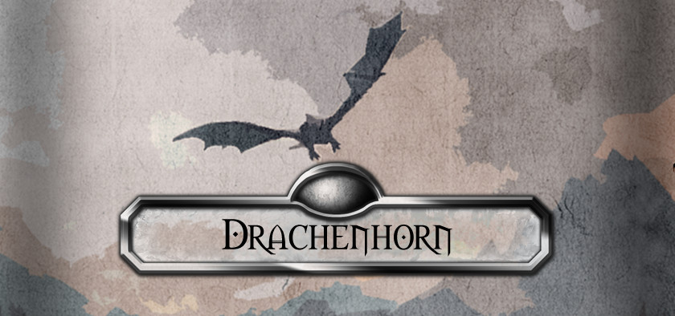

Dies ist ein Programm zu Erstellung von Charakterbögen in DSA.

>"Das PDF ist echt nervig und langwierig auszufüllen, kannst du da nicht mal was schreiben Daniel?" - Unser Spielleiter

Und so hat das alles angefangen.

## Download

## Benutzung

Grundsätzlich nach dem selben Prinzip, wie den PDF-Bogen.

## Erstelle dein eigenes Programm

Der Code für die Verwendung der Charakterbogen-Dateien befindet sich auf NuGet und kann von jedem verwendet werden, der selber auch Programme für dieses Dateiformat schreiben möchte.

## Support/Bugs

Für Unterstützung bitte ein neues [Issue](https://github.com/lightlike/Drachenhorn/issues) erzeugen.

## Entwickeln

Grundsätzlich kann jeder mit normal Github-Abläufen zu diesem Programm beitragen, allerdings wäre es schön, wenn ihr damit wartet, bis die Version [0.1.0.0](https://github.com/lightlike/Drachenhorn/milestone/1) Fertig ist, damit ich die Grundstruktur erstellen kann.
