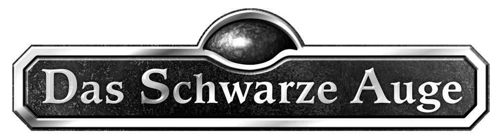

<h1 align="center">DSACharacterSheet</h1>

  
  

  
  

  
  

Dies ist ein Programm zu Erstellung von Charakterbögen in DSA.

>"Das PDF ist echt nervig und langwierig auszufüllen, kannst du da nicht mal was schreiben Daniel?" - Unser Spielleiter

Und so hat das alles angefangen.

## Installation

Einfach das Setup herunterladen und ausführen

## Benutzung

Grundsätzlich nach dem selben Prinzip, wie den PDF-Bogen.

## Support/Bugs

Für Unterstützung bitte ein neues [Issue](https://github.com/lightlikeD/DSACharacterSheet/issues) erzeugen.

## Entwickeln

Grundsätzlich kann jeder mit normal Github-Abläufen zu diesem Programm beitragen, allerdings wäre es schön, wenn ihr damit wartet, bis die Version [1.1.0.0](https://github.com/lightlikeD/DSACharacterSheet/milestone/1) Fertig ist, damit ich die Grundstruktur erstellen kann.