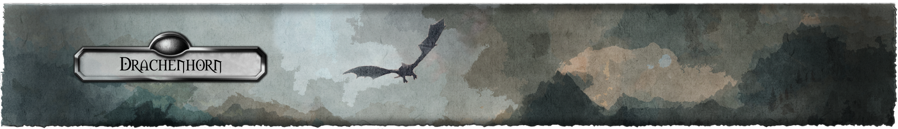

<!--<h1 align="center">Drachenhorn Charakterbogen</h1>-->

  
  

  
  
  

### Other Languages

	

## Introduction
        
Drachenhorn is a Programm to create "Pen & Paper"-Characters on any Rule-System based on the "Das Schwarze Auge" (German, The black Eye)

>"The PDF is really annoying and takes some time to fill completely. Daniel couldn't you create something to help with that?" - Our Gamemaster

And that is how this all started.

 

 

## Download

## Usage

Select a Rule-System and create the Character using the helper like a simple Installer. (*Not finished yet*)

## Create your own application

The code to read the Character-Sheets (".dsac") and Rule-Templates (".dsat") can be found on NuGet for anybody to use.

  
  

## Support/Bugs

  

For any Bug-Reports or Feature-Request please open an [Issue](https://github.com/Drachenhorn-Team/Drachenhorn/issues) containing all needed information.

## Development

Anyone can held if he/she wants to. I really appreciate any help. Just fork it and create Pull-Request when finished.

*But please wait for Version 0.1.0.0 for me to establish basic behaviour.*
